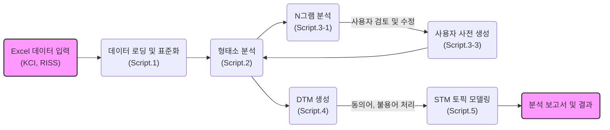

# R을 이용한 한국어 학술데이터 텍스트마이닝

[](LICENSE)
[](https://github.com/rubato103/textmining_KCI_RISS/commits/main)
[](https://github.com/rubato103/textmining_KCI_RISS)

한국어 학술 논문 데이터를 대상으로 한 형태소 분석, N그램 추출, 토픽 모델링 통합 파이프라인

## 프로젝트 개요

### 주요 기능

- **다중 데이터 소스 지원**: KCI 및 RISS Excel 데이터 자동 통합
- **고성능 형태소 분석**: Kiwipiepy 및 CoNg 모델 병렬 처리
- **사용자 사전 최적화**: N그램 분석 기반 복합명사 자동 추천
- **STM 토픽 모델링**: 메타데이터 기반 시계열 및 범주 분석
- **완전 자동화**: 대화형 인터페이스를 통한 원클릭 실행

### 기술 스택

- **언어**: R 4.5.1 이상
- **형태소 분석기**: [Kiwipiepy](https://github.com/bab2min/kiwipiepy), CoNg 모델
- **토픽 모델링**: STM (Structural Topic Model)
- **병렬 처리**: R parallel 패키지
- **시각화**: ggplot2, wordcloud

## 주요 워크플로우



## 프로젝트 구조

```
textming_KCI_RISS/
├── scripts/                 # 모든 R 스크립트
├── data/
│   ├── raw_data/            # 원본 Excel 데이터 (Git 추적 제외)
│   ├── processed/           # 처리된 결과 (Git 추적 제외)
│   └── dictionaries/        # 사용자 사전 (Git 추적 제외)
├── reports/                 # 분석 보고서 (Git 추적 제외)
├── CITATION.md              # 인용 가이드
├── LICENSE                  # 라이선스 정보
└── cong-base/              # CoNg 모델 (Git 추적 제외)
```

## 빠른 시작

### 1. 환경 설정

```r
# 필수 패키지 설치
packages <- c("readxl", "dplyr", "tidyr", "stringr", "parallel", 
              "stm", "ggplot2", "wordcloud", "reticulate")
install.packages(packages)

# Python 환경 (Kiwipiepy)
pip install kiwipiepy
```

### 2. 데이터 준비

```bash
# KCI 또는 RISS Excel 파일을 data/raw_data/ 폴더에 복사
```

### 3. 전체 파이프라인 실행

```r
source("scripts/00_run_pipeline.R")
```

## 주요 특징

### 다중 데이터 소스 호환성

- **KCI**: 고유 논문 ID 기반
- **RISS**: 해시 기반 고유 ID 자동 생성
- **동일한 파이프라인**으로 두 데이터 모두 처리

### 성능 최적화

- **병렬 처리**: 15개 코어 활용 (26.9 문서/초)
- **메모리 최적화**: 대용량 데이터 안정적 처리
- **배치 처리**: 자동 배치 크기 조정

### 지능형 사전 관리

- **N그램 기반**: 복합명사 자동 발견
- **빈도 필터링**: 의미 있는 용어만 선별
- **사용자 검토**: 수동 검토 후 사전 등록

## 설정 및 커스터마이징

### config.R 주요 설정

```r
PROJECT_CONFIG <- list(
  morpheme_analysis = list(
    default_model = "kiwipiepy",
    use_cong_model = FALSE,
    parallel_cores = "auto"
  ),
  ngram_analysis = list(
    default_n_values = c(2, 3),
    min_frequency = 3,
    max_candidates = 1000
  )
)
```

### 환경 변수 재정의

```bash
export MORPHEME_CORES=8
export INTERACTIVE_MODE=false
export USE_USER_DICT=true
```

## 기여하기

1. 저장소 포크 (Fork the repository)
2. 기능 브랜치 생성 (Create a feature branch)
3. 변경 사항 커밋 (Commit your changes)
4. 브랜치 푸시 (Push to the branch)
5. 풀 리퀘스트 생성 (Create a Pull Request)

## 인용 (Citation)

**중요**: 본 코드를 활용할 경우 반드시 인용 표기 바랍니다.

### 이 파이프라인 인용

#### 국문

```
양연동. (2025). R을 이용한 한국어 학술데이터 텍스트마이닝. GitHub Repository. https://github.com/rubato103/textmining_KCI_RISS
```

#### 영문

```
Yang, Y. (2025). Text Mining of Korean Academic Data using R. GitHub Repository. https://github.com/rubato103/textmining_KCI_RISS
```

### Kiwi 형태소 분석기 인용 (필수)

```
이민철. (2024). Kiwi: 통계적 언어 모델과 Skip-Bigram을 이용한 한국어 형태소 분석기 구현. 
디지털인문학, 1(1), 109-136. https://doi.org/10.23287/KJDH.2024.1.1.6
```

**상세한 인용 가이드**: [CITATION.md](CITATION.md)

## 라이선스

본 프로젝트는 **학술 및 교육용 라이선스**를 따릅니다.

### 허용되는 사용

- **학술 연구** 및 논문 발표
- **교육 목적** (대학, 학교 등)
- **비영리 연구** 활동
- **개인 학습** 및 연구

### 금지되는 사용

- **상업적 이용** (컨설팅, 분석 서비스 등)
- **수익 창출** 목적 사용
- **기업 제품/서비스**에 포함

### 상업적 이용 문의

별도의 상업용 라이선스에 대해 문의 바랍니다: [GitHub Issues](../../issues)

## 연락처

- 문의: rubato103@dodaseo.cc

## 문제 해결

### 일반적인 문제들

**1. Python 환경 문제**

```r
# reticulate 재설정
library(reticulate)
py_config()
```

**2. CoNg 모델 없음**

- `use_cong_model = FALSE`로 설정하여 기본 Kiwipiepy 사용

**3. 메모리 부족**

- `parallel_cores` 값을 낮춤 (예: 4)
- 배치 크기 조정

### 로그 확인

분석 과정의 상세 로그는 `reports/` 폴더의 각 단계별 보고서에서 확인 가능합니다.
